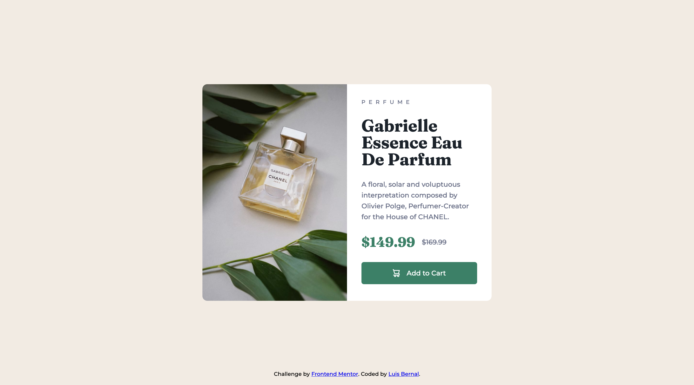

# Frontend Mentor - Product preview card component solution

This is a solution to the [Product preview card component challenge on Frontend Mentor](https://www.frontendmentor.io/challenges/product-preview-card-component-GO7UmttRfa). Frontend Mentor challenges help you improve your coding skills by building realistic projects.

## Table of contents

- [Overview](#overview)
  - [The challenge](#the-challenge)
  - [Screenshot](#screenshot)
  - [Links](#links)
- [My process](#my-process)
  - [Built with](#built-with)
  - [What I learned](#what-i-learned)
  - [Continued development](#continued-development)

**Note: Delete this note and update the table of contents based on what sections you keep.**

## Overview

### The challenge

Users should be able to:

- View the optimal layout depending on their device's screen size
- See hover and focus states for interactive elements

### Screenshot

### Links

- Solution URL: [https://github.com/FrontendMentor-Lecap/Product-preview-card-component]
- Live Site URL: [https://frontendmentor-lecap.github.io/Product-preview-card-component/]

## My process

### Built with

- Semantic HTML5 markup
- CSS custom properties
- Flexbox
- Mobile-first workflow

### What I learned

I'm returning from a long break from coding with this challenge. Had fun writing and getting back to basics, setting GitHub, using VSCode, creating files and folders in terminal. Writing the HTML was somehow strange since I had forgotten the semantics.

### Continued development

I need to keep writing, taking one day at a time, to prevent getting burned. Keep learning about HTML Semantics and CSS before advancing to JS.
